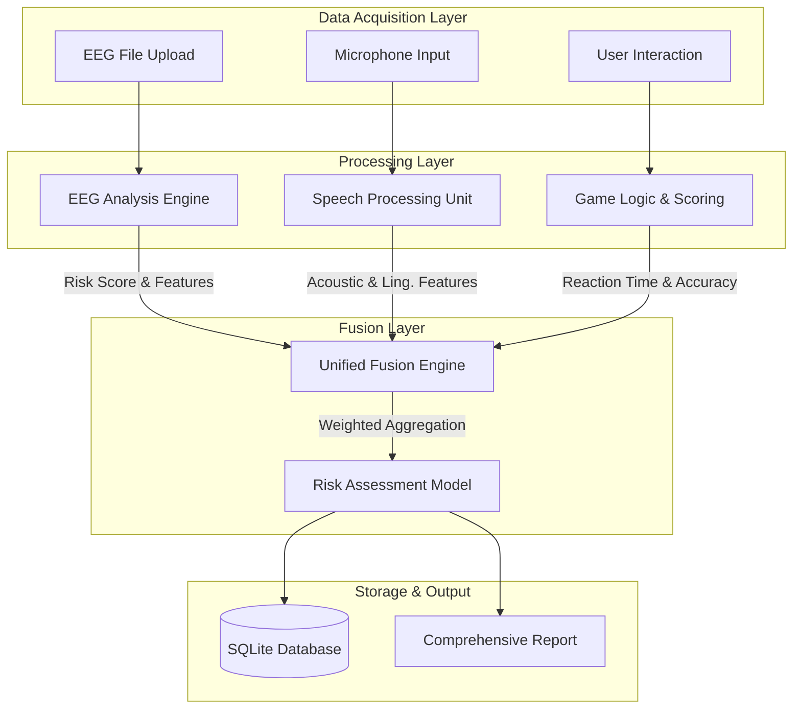
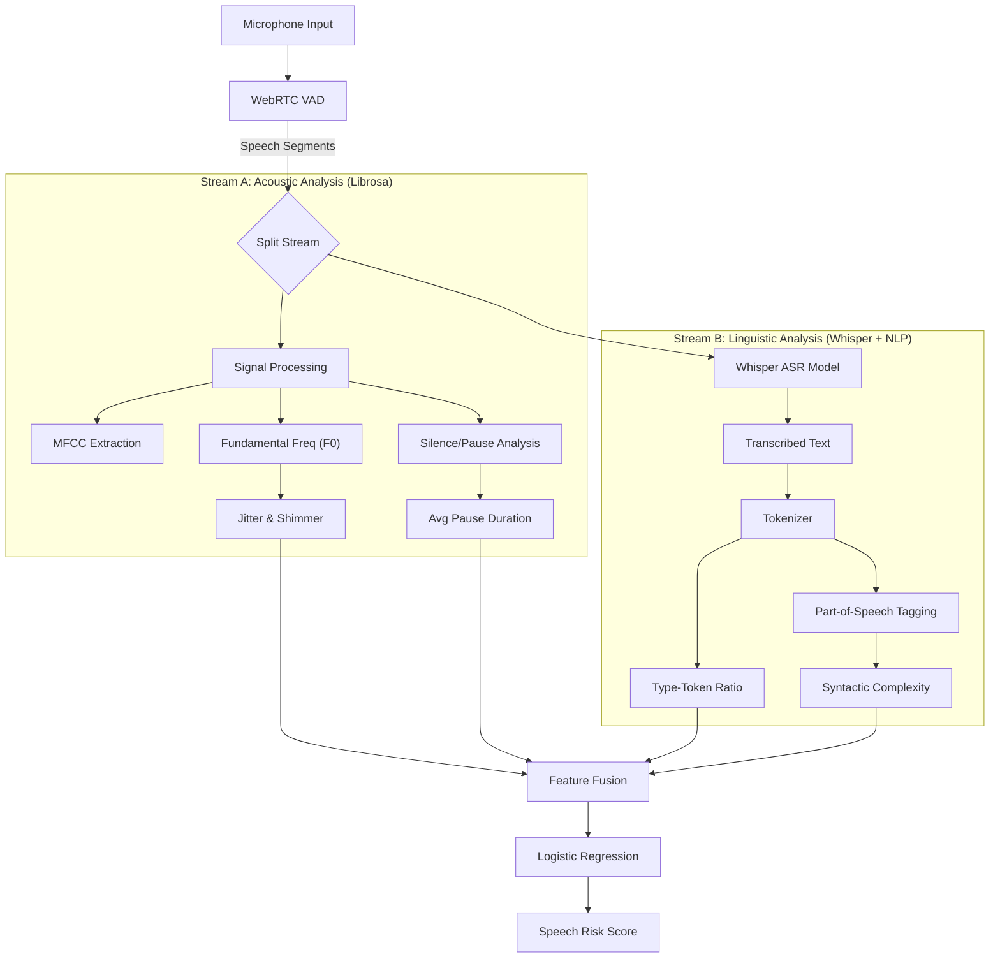

# 🧠 CogniSafe
### AI-Powered Multi-Modal Cognitive Health Assessment Platform

  

> **Revolutionizing early detection of neurodegenerative disorders through the fusion of EEG signal processing, speech biomarkers, and gamified cognitive testing.**

---

## 🚀 Overview

**CogniSafe** is a state-of-the-art diagnostic support tool designed to screen for early signs of cognitive decline (MCI, Alzheimer's, Dementia). Unlike traditional paper-based tests, CogniSafe leverages **multi-modal AI** to analyze three distinct biological and behavioral data streams:

1.  **Neurophysiological**: EEG brainwave analysis.
2.  **Biomarker**: Speech acoustic and linguistic patterns.
3.  **Behavioral**: Gamified cognitive challenges.

By synthesizing these diverse data points, CogniSafe provides a holistic, objective, and highly accurate risk assessment score.

---

## 🏗️ System Architecture

### 🌐 Combined System Architecture
This diagram illustrates how the three distinct modalities converge into the Unified Fusion Engine to produce the final cognitive health assessment.



---

## 🧩 Deep-Dive Module Architectures

### 1. 🧠 EEG Analysis Module
The EEG pipeline is designed to detect "spectral slowing," a hallmark of early-stage neurodegeneration. It processes raw multi-channel signals to extract frequency-domain biomarkers.

**Technical Workflow:**
1.  **Ingestion**: Accepts `.edf` (European Data Format) or `.csv` files.
2.  **Preprocessing**:
    *   **Resampling**: Standardizes all inputs to 256 Hz.
    *   **Filtering**: Applies a 5th-order Butterworth bandpass filter (0.5 - 50 Hz) to remove DC drift and high-frequency noise.
    *   **Notch Filter**: Removes 50/60 Hz power line interference.
3.  **Feature Engineering**:
    *   Computes **Power Spectral Density (PSD)** using Welch's method (Hamming window, 50% overlap).
    *   Calculates **Relative Band Power (RBP)** for 5 bands: Delta (0.5-4Hz), Theta (4-8Hz), Alpha (8-13Hz), Beta (13-30Hz), Gamma (30-45Hz).
    *   Derives clinical ratios: **Theta/Beta Ratio (TBR)** and **Delta/Alpha Ratio (DAR)**.
4.  **Classification**: A trained Random Forest classifier (100 trees) predicts the probability of cognitive impairment based on the feature vector.

```mermaid
graph TD
    subgraph "1. Preprocessing Pipeline"
        Raw[Raw EEG Data] --> Resample[Resample @ 256Hz]
        Resample --> Bandpass[Bandpass Filter 0.5-50Hz]
        Bandpass --> Notch[Notch Filter 60Hz]
        Notch --> Artifact["Artifact Rejection (ICA)"]
    end

    subgraph "2. Feature Extraction (Frequency Domain)"
        Artifact --> Welch[Welch's Periodogram]
        Welch --> PSD[Power Spectral Density]

        PSD --> |Integration| Bands

        subgraph "Spectral Bands"
            Bands --> Delta["Delta (0.5-4Hz)"]
            Bands --> Theta["Theta (4-8Hz)"]
            Bands --> Alpha["Alpha (8-13Hz)"]
            Bands --> Beta["Beta (13-30Hz)"]
        end

        Delta & Theta & Alpha & Beta --> Ratios[Clinical Ratios]
        Ratios --> TBR["Theta/Beta Ratio"]
        Ratios --> DAR["Delta/Alpha Ratio"]
    end

    subgraph "3. Inference Engine"
        TBR & DAR & Bands --> Vector[Feature Vector (1x18)]
        Vector --> RF[Random Forest Model]
        RF --> Prob[Risk Probability %]
    end
```

### 2. 🗣️ Speech & Linguistic Module
This module utilizes a **dual-stream architecture** to analyze both *how* the user speaks (Acoustic) and *what* they say (Linguistic).

**Technical Workflow:**
1.  **Acoustic Stream**:
    *   **VAD (Voice Activity Detection)**: Segments speech from silence using energy thresholds.
    *   **Prosodic Features**: Extracts pitch (F0), jitter (micro-fluctuations in pitch), and shimmer (micro-fluctuations in loudness).
    *   **Temporal Features**: Measures Speech-to-Pause Ratio (SPR) and Articulation Rate.
2.  **Linguistic Stream**:
    *   **ASR**: Uses **OpenAI Whisper (Base model)** for robust transcription.
    *   **NLP Pipeline**: Tokenizes text to calculate **Type-Token Ratio (TTR)** (vocabulary richness) and dependency depth (syntactic complexity).
    *   **Sentiment**: Analyzes emotional valence (apathy is a risk factor).



### 3. 🎮 Cognitive Games Module
The games module is an event-driven system that captures high-resolution behavioral data (millisecond precision) to map performance to specific cognitive domains.

**Technical Workflow:**
1.  **Event Loop**: React `requestAnimationFrame` loop captures user inputs with <16ms latency.
2.  **Metric Calculation**:
    *   **Stroop**: Calculates "Interference Score" (Reaction Time Incongruent - Reaction Time Congruent).
    *   **Trail Making**: Tracks "Time to Completion" and "Error Rate" (wrong node connections).
    *   **Memory**: Measures "Span" (max items recalled) and "Working Memory Accuracy".
3.  **Normalization**: Raw scores are Z-scored against age-matched population norms (simulated) to determine percentiles.

```mermaid
graph TD
    User[User Interaction] -->|Touch/Click| EventListener[Event Listener]

    subgraph "Game Engines"
        EventListener --> Memory[Memory Match Engine]
        EventListener --> Stroop[Stroop Test Engine]
        EventListener --> Trail[Trail Making Engine]
    end

    subgraph "Raw Metric Capture"
        Memory -->|State Change| MemAcc["Accuracy %"]
        Stroop -->|Timestamp Diff| RT["Reaction Time (ms)"]
        Trail -->|Path Validation| Errors[Error Count]
    end

    subgraph "Cognitive Domain Mapping"
        MemAcc --> DomainMem[Memory Domain]
        RT --> DomainAtt[Attention Domain]
        Errors --> DomainExec[Executive Function]

        DomainMem & DomainAtt & DomainExec --> Norm[Z-Score Normalization]
    end

    Norm --> FinalScores[Domain Scores (0-100)]
```

---

## 🧩 Core Modules

### 1. 🧠 EEG Analysis Engine
The EEG module processes raw brainwave data (EDF/CSV formats) to detect spectral abnormalities associated with cognitive decline, such as the "slowing" of background rhythms (increased Theta/Delta, decreased Alpha/Beta).

**Key Capabilities:**
*   **Signal Preprocessing**: Artifact removal and bandpass filtering.
*   **Feature Extraction**: Calculates Relative Band Power (RBP) for Delta, Theta, Alpha, Beta, and Gamma bands.
*   **ML Inference**: Random Forest classifier trained on clinical EEG datasets.

```python
# Snippet: Feature Extraction Logic
def extract_features(data, fs=256):
    # Calculate Power Spectral Density (PSD)
    freqs, psd = welch(data, fs=fs, nperseg=fs*2)

    # Extract Band Powers
    bands = {
        'Delta': (0.5, 4), 'Theta': (4, 8),
        'Alpha': (8, 13), 'Beta': (13, 30)
    }

    features = []
    for band, (low, high) in bands.items():
        # Integrate PSD over the frequency band
        idx_band = np.logical_and(freqs >= low, freqs <= high)
        band_power = simps(psd[idx_band], dx=freqs[1]-freqs[0])
        features.append(band_power)

    return np.array(features)
```

### 2. 🗣️ Speech & Linguistic Analysis
This module analyzes spontaneous speech to find subtle markers of cognitive impairment, such as hesitation, reduced vocabulary, and acoustic flatness.

**Key Capabilities:**
*   **Transcription**: Uses **OpenAI Whisper** for high-accuracy speech-to-text.
*   **Acoustic Analysis**: Extracts jitter, shimmer, pitch variability, and pause duration using `librosa`.
*   **Linguistic Analysis**: Measures lexical diversity (TTR) and syntactic complexity.

```python
# Snippet: Acoustic Feature Extraction
def analyze_speech_features(audio_path):
    y, sr = librosa.load(audio_path)

    # Extract Pitch (F0)
    f0, voiced_flag, voiced_probs = librosa.pyin(y, fmin=librosa.note_to_hz('C2'), fmax=librosa.note_to_hz('C7'))

    # Calculate Pause Duration (Silence Analysis)
    intervals = librosa.effects.split(y, top_db=20)
    silence_duration = (len(y) - sum(len(i) for i in intervals)) / sr

    return {
        "avg_pitch": np.nanmean(f0),
        "pause_duration": silence_duration,
        "speech_rate": len(transcribed_text.split()) / (len(y)/sr)
    }
```

### 3. 🎮 Cognitive Gamification
A suite of interactive neuropsychological tests gamified to assess specific cognitive domains.

*   **Memory Match**: Visual working memory.
*   **Stroop Test**: Selective attention and inhibition.
*   **Trail Making**: Executive function and processing speed.
*   **Pattern Recognition**: Fluid intelligence.

**Implementation:**
React components capture millisecond-precision reaction times and accuracy metrics, which are then normalized against age-matched baselines in the backend.

### 4. 📊 Unified Intelligence (Fusion Engine)
The brain of the system. It aggregates results from all three modalities to produce a final weighted risk score.

**Fusion Logic:**
*   **EEG Weight**: 40% (Objective physiological data)
*   **Speech Weight**: 35% (Strong biomarker correlation)
*   **Games Weight**: 25% (Behavioral performance)

```python
# Snippet: Unified Scoring Logic
def calculate_overall_risk(eeg_score, speech_score, game_score):
    weights = {"eeg": 0.40, "speech": 0.35, "games": 0.25}

    weighted_score = (
        (eeg_score * weights["eeg"]) +
        (speech_score * weights["speech"]) +
        (game_score * weights["games"])
    )

    risk_level = "Low" if weighted_score < 40 else "High" if weighted_score > 70 else "Medium"
    return weighted_score, risk_level
```

---

## ✨ Key Features

*   **⚡ Real-Time Analysis**: Instant feedback on cognitive tests and EEG uploads.
*   **🔄 Session Persistence**: Robust state management allows users to refresh or return to the dashboard without losing progress.
*   **🛡️ Privacy-First**: All data is processed locally or via secure endpoints; no data is shared with third parties.
*   **📈 Comprehensive Reporting**: Generates detailed PDF-ready reports with radar charts for cognitive domains (Memory, Attention, Language, etc.).
*   **🎯 Domain-Specific Scoring**: Breaks down performance into granular cognitive categories rather than just a single number.

---

## 🛠️ Getting Started

Follow these steps to set up CogniSafe on your local machine.

### Prerequisites
*   Python 3.9+
*   Node.js 16+
*   FFmpeg (for audio processing)

### 1. Backend Setup
```bash
# Clone the repository
git clone https://github.com/yourusername/cogni-safe.git
cd cogni-safe/backend

# Create virtual environment
python -m venv venv
source venv/bin/activate  # or venv\Scripts\activate on Windows

# Install dependencies
pip install -r requirements.txt

# Run the server
uvicorn app.main:app --reload
```
*Server will start at `http://localhost:8000`*

### 2. Frontend Setup
```bash
cd ../frontend

# Install dependencies
npm install

# Start the development server
npm run dev
```
*App will launch at `http://localhost:5173`*

---

## 💻 Tech Stack

| Component | Technologies |
|-----------|--------------|
| **Frontend** | React, TypeScript, Tailwind CSS, Recharts, Framer Motion |
| **Backend** | Python, FastAPI, SQLAlchemy, Pydantic |
| **Database** | SQLite (Development), PostgreSQL (Production ready) |
| **ML & Data** | Scikit-learn, NumPy, Pandas, PyEEG |
| **Audio** | OpenAI Whisper, Librosa, PyDub |